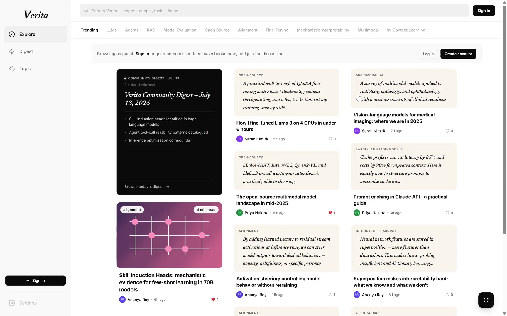
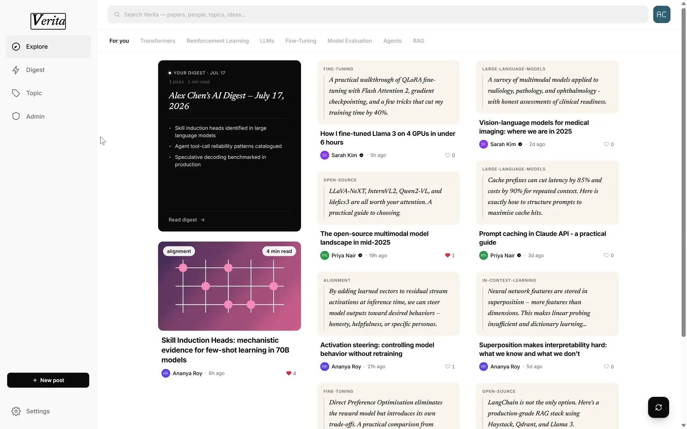
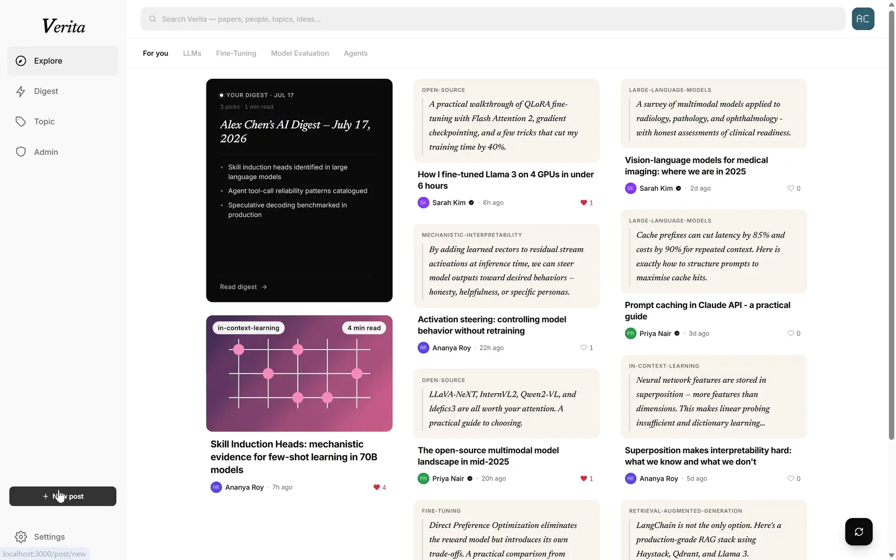
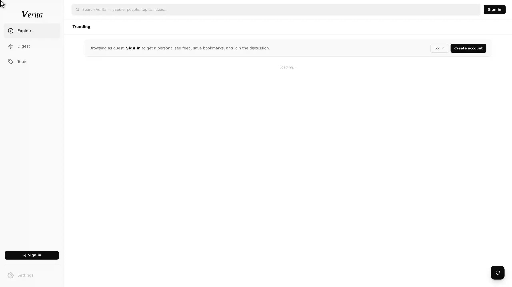

<div align="center">

<picture>
  <source media="(prefers-color-scheme: dark)" srcset="docs/assets/header-dark.svg">
  
</picture>

</div>

Verita is an AI-focused community platform where developers, researchers, and enthusiasts
share and discover practical AI knowledge through intelligent curation, automated
summarization, and personalized recommendations. It is built as four backend microservices
(three Spring Boot, one FastAPI) behind a React frontend.

- **Reviewing the project?** Start with the [Review Guide](docs/review/Review_Guide.md).
- **Developing locally?** See [Local Development](docs/contributing/Local_Development.md).
- **Everything else:** the [documentation index](#documentation) below.

[](https://AET-DevOps26.github.io/team-colleague-md/)


## Architecture at a Glance

<div align="center">


</div>

Full rationale in
[System Overview & Architecture](docs/architecture/System_Overview_Architecture.md) and the
[ADRs](docs/adr/).

## Quick Start with Docker Compose (Local)

The fastest way to run the full platform.

**First-time setup.** Create `genai-service/.env` from the template:

```bash
cp genai-service/.env.example genai-service/.env
```

The recommended setup for testing GenAI is Logos with `openai/gpt-oss-120b`, which is already
the template default. Add a real `LOGOS_API_KEY` in `genai-service/.env` to enable AI summaries
and daily digest generation. A `GNEWS_API_KEY` is recommended for reliable digest source coverage,
but is not required to run the service. See
[GenAI Environment Setup](docs/contributing/GenAI_Environment_Setup.md) for the other providers
and source API keys.

Run the docker compose from the repository root:

```bash
docker compose up --build
```

This builds the application services plus one PostgreSQL database per service, MinIO object
storage, and a local mail sink:

| Service | URL | Description |
|---|---|---|
| `frontend` | http://localhost:3000 | React UI (served by nginx) |
| `user-service` | http://localhost:8081 | Spring Boot — user identity & auth |
| `content-service` | http://localhost:8082 | Spring Boot — posts, comments & topics |
| `recommendation-service` | http://localhost:8083 | Spring Boot — feeds & notifications |
| `genai-service` | http://localhost:8000 | FastAPI — AI summaries & daily digest |
| `user-db` | localhost:5432 | PostgreSQL — user-service data |
| `content-db` | localhost:5433 | PostgreSQL — content-service data |
| `recommendation-db` | localhost:5434 | PostgreSQL — recommendation-service data |
| `minio` | http://localhost:9000 | S3-compatible object storage (admin console: http://localhost:9001) |
| `mailpit` | http://localhost:8025 | Local mail sink — captures password-reset mail |

Common lifecycle commands:

```bash
docker compose down                       # stop all services (data is kept)
docker compose down -v                    # stop and delete all data (DBs + object storage)
docker compose up --build user-service    # start a single service only
```

Database and MinIO connection details and credentials live in
[Local Development](docs/contributing/Local_Development.md).

### Seed Demo Data

A fresh stack starts empty. Once the services are healthy, seed the local databases with
demo users, posts, topics, comments, bookmarks, votes, follows, and notifications:

```bash
npm install
npm run seed:local
```

The seed is idempotent and non-destructive; options and the full breakdown are in
[Local Development](docs/contributing/Local_Development.md#local-seed-data).

Then open http://localhost:3000, sign in as a [demo account](#demo-accounts), and follow
the [Review Guide](docs/review/Review_Guide.md) for a guided tour.

A Prometheus + Grafana stack can be layered on top — see the
[Review Guide](docs/review/Review_Guide.md#5-view-monitoring) to bring it up, and
[`infra/monitoring/README.md`](infra/monitoring/README.md) for what is collected and the
Azure/Kubernetes variants.

## Cloud Deployments

Live environments:

| Environment | URL | Platform |
|---|---|---|
| Production | https://verita.stud.k8s.aet.cit.tum.de/ | Kubernetes (Rancher) |
| Development | https://dev.verita.stud.k8s.aet.cit.tum.de/ | Kubernetes (Rancher) |
| Azure VM | http://REPLACE_ME_WITH_VM_IP/ | Docker Compose on a single VM |

> Note: don't forget to type `thisisunsafe` when the browser warns about the self-signed
> TLS certificate on the dev environment.

See [Infrastructure Design](docs/infrastructure/Infrastructure_Design.md) and the
[Helm Chart](infra/helm/verita/README.md) for how these are provisioned and deployed.

## Demo Accounts

Authentication is always against the real backend. Seed the database (`npm run seed:local`)
to create the demo users, then log in at http://localhost:3000. All seed users share the
password `Password123!`; profiles, posts, bookmarks, and likes are populated by the seed.

| Display Name | Username | Role |
|---|---|---|
| Alex Chen | `alexchen` | Admin |
| Sarah Kim | `sarahjkim` | Verified |
| Marcello Rossi | `marcello_r` | User |

## Documentation

Project-wide documentation lives under [`docs/`](docs/) — full index in
[`docs/README.md`](docs/README.md). Component and tooling docs live next to the code they
describe. Key entry points:

| Document | What's inside |
|---|---|
| [Review Guide](docs/review/Review_Guide.md) | Reviewer walkthrough: explore checklist, health checks, monitoring |
| [Team Responsibilities](docs/review/Team_Responsibilities.md) | Who owned which area, derived from the pull-request history |
| [Problem Statement](docs/product/Problem_Statement.md) | The problem Verita solves, target users, and epics/user stories |
| [System Overview & Architecture](docs/architecture/System_Overview_Architecture.md) | Services, technology decisions, data architecture, UML diagrams |
| [Infrastructure Design](docs/infrastructure/Infrastructure_Design.md) | Infrastructure hub: environments, IaC, CI/CD, and deployments |
| [API Gateway & Routing](docs/infrastructure/API_Gateway_Routing.md) | Path-prefix routing across local, Azure, and Kubernetes |
| [Database Schemas](docs/database/schema.md) | Database-per-service model and per-service schema docs |
| [Testing Strategy](docs/testing/Testing.md) | Test tooling, coverage gates, and how to run tests per service |
| [Local Development](docs/contributing/Local_Development.md) | Prerequisites, backend infrastructure, seed data, per-service builds |
| [Git Branching Guide](docs/contributing/Git_Branching_Guide.md) | Branch naming and pull-request workflow |
| [Monitoring](infra/monitoring/README.md) | Prometheus + Grafana stack for Compose and Kubernetes |
| [Helm Chart](infra/helm/verita/README.md) | Kubernetes deployment via the `verita` umbrella chart |

## See It Running

Recorded against a real, seeded stack — every screen below is the running application, not a mockup.
Clips are sped up to keep them short.

### The core loop



Sign in against the real user-service, and the guest banner gives way to a
[personally ranked](docs/adr/0003-feed-ranking-and-input-sourcing.md) **For you** feed. Read a post,
then like, save, share, and comment — every count moves against the live backend.

### The daily digest



One [digest](docs/adr/0019-standalone-digest-entity.md) per day, the reader's own badged
*Personalized*. It is assembled from Hugging Face, GNews, and GitHub, then written by the LLM — the
clip follows a citation out to the real release page behind it.

### Authoring



Write in Markdown and watch it render live, KaTeX math included. Add sources and tags, publish, and
the post goes straight to the AI for summarizing.

### Admin: operating the AI



The Operations panel reads `active:` back from GenAI and can
[switch the provider and model](docs/adr/0020-runtime-llm-selection-and-admin-ops.md) at runtime.
Re-summarize a real post, watch the job land `COMPLETED` against a live LLM, then read the summary
it just wrote — stamped with the model behind it.
