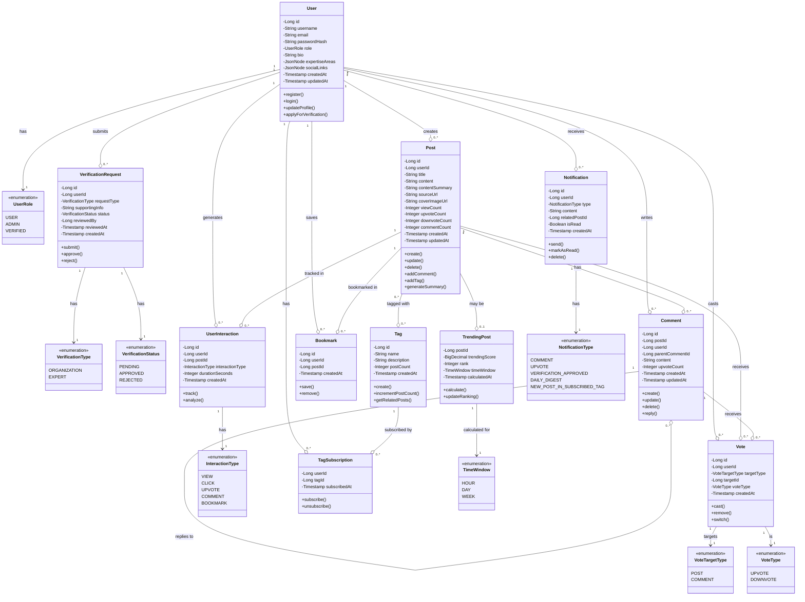

# System Overview → Architecture

**Project:** AI Knowledge Sharing Platform (Verita)  
**Team:** Colleagues.md
**Date:** May 2026  
**Version:** 1.0

---

## Table of Contents

1. [System Overview](#1-system-overview)
2. [Technology Stack Decisions](#2-technology-stack-decisions)
3. [System Architecture](#3-system-architecture)
4. [UML Diagrams](#4-uml-diagrams)
5. [Initial Product Backlog](#5-initial-product-backlog)
6. [Technical Documentation Roadmap](#6-technical-documentation-roadmap)

---

## 1. System Overview

### 1.1 Project Description

Verita is an AI-focused community platform designed to address the information overload problem in the rapidly evolving AI industry. The platform enables developers, researchers, and enthusiasts to share and discover practical AI knowledge through intelligent content curation, automated summarization, and personalized recommendations.

### 1.2 Core System Components

The system follows a microservices architecture consisting of:

**Service Layer:**
- **User Service:** Authentication, profile management, account verification
- **Content Service:** Posts, comments, tags, voting, bookmarks
- **Recommendation Service:** Personalized feed, trending calculation, notifications
- **GenAI Service:** AI-powered summarization, tag suggestion, daily digest

**Infrastructure Layer:**
- **API Gateway:** JWT authentication, request routing, rate limiting
- **PostgreSQL Database:** Logically separated schemas per service
- **Monitoring Stack:** Prometheus and Grafana for observability

**Client Layer:**
- **React Frontend:** Web application with Markdown editor, masonry layout, real-time updates

### 1.3 System Architecture Diagram

**[PLACEHOLDER - To be created in draw.io]**

This diagram will show:
- System layers (Client, Gateway, Services, Database, Monitoring)
- Communication protocols (HTTPS/REST, JDBC)
- Deployment environments (Docker Compose, Kubernetes)

---

## 2. Technology Stack Decisions

### 2.1 Backend Services

```yaml
Framework: Spring Boot 3.5.10
Language: Java 21
Build Tool: Gradle (Groovy DSL)
Database Access: Spring Data JPA + Hibernate
Authentication: JWT (JSON Web Tokens)
Testing: JUnit 5, Mockito, Spring Boot Test
Key Libraries:
  - Spring Security (authentication/authorization)
  - Spring Web (REST API)
  - Spring Actuator (monitoring endpoints)
```

**Rationale:**
- Spring Boot is mandated by course requirements and provides mature ecosystem
- Gradle chosen as TUM Java course standard with faster builds than Maven
- JWT enables stateless authentication suitable for microservices architecture
- Spring Actuator integrates seamlessly with Prometheus for monitoring

**JWT Authentication Flow:**
1. User logs in with credentials → Server validates and generates JWT
2. Client stores JWT (localStorage) and includes in `Authorization: Bearer <token>` header
3. Each service independently validates JWT signature without database lookup
4. Token expires after 24 hours, requiring re-authentication

**Why JWT over Session-based Auth:**
- **Stateless:** No server-side session storage required
- **Scalable:** Each microservice validates tokens independently
- **Distributed-friendly:** Works across multiple services without sticky sessions

---

### 2.2 Frontend Application

**Phase 1: Conservative Stack (MVP - Weeks 1-4)**

```yaml
Core Framework:
  - React 18 with TypeScript
  - Build Tool: Vite
  - Package Manager: npm

Essential Libraries:
  - Routing: React Router v6
  - HTTP Client: Axios
  - UI Components: Chakra UI (out-of-the-box components)
  - Styling: Chakra UI's built-in system
  - Forms: React Hook Form + Zod validation
  - Markdown: react-markdown + react-syntax-highlighter
```

**Rationale for Conservative Approach:**
- Chakra UI requires minimal configuration, ideal for team members new to React
- Single styling system reduces learning curve
- All libraries have extensive documentation and active communities
- Focus on learning React fundamentals before introducing complex patterns

**Phase 2: Optimization (Weeks 5-8)**

```yaml
Performance:
  - State Management: Zustand (lightweight global state)
  - Server State: React Query (caching, refetching)
  - Code Splitting: React.lazy + Suspense

Enhanced Features:
  - Layout: react-masonry-css (Pinterest-style card grid)
  - Infinite Scroll: react-infinite-scroll-component
  - Animations: Framer Motion
```

**Phase 3: Advanced (Weeks 9-12)**

```yaml
Potential Upgrades:
  - UI Library: shadcn/ui or Ant Design (if more customization needed)
  - Styling: Tailwind CSS (utility-first approach)
  - Framework: Next.js 14 (SSR, better SEO)
  - Real-time: Socket.io for live updates
```

**Progressive Enhancement Strategy:**
Start simple → Add complexity only when needed → Optimize based on real requirements

---

### 2.3 GenAI Service

```yaml
Framework: FastAPI (Python 3.12)
AI Framework: LangChain
LLM Support:
  Cloud (Required - P1):
    - OpenAI API (GPT-4, GPT-3.5-turbo)
  Local (Optional - P2):
    - GPT4All
    - LLaMA via Ollama
Testing: pytest, pytest-asyncio
API Documentation: Auto-generated via FastAPI (Swagger UI)
```

**Rationale:**
- FastAPI provides automatic OpenAPI documentation and async support
- LangChain simplifies prompt management and LLM integration
- Cloud models prioritized for MVP due to superior quality and easier setup
- Local model support deferred to P2 for cost optimization and offline capability

---

### 2.4 Database

```yaml
Database System: PostgreSQL 16
Schema Organization: Logical separation per microservice
  - user_schema (User Service)
  - content_schema (Content Service)
  - recommendation_schema (Recommendation Service)

Key Features:
  - JSONB: Flexible storage for user preferences, expertise areas
  - Full-text Search: GIN indexes on post title/content
  - Advanced Indexing: Composite indexes for complex queries
  - ACID Compliance: Ensures data consistency

Connection Pooling: HikariCP (Spring Boot default)
```

**Rationale for PostgreSQL over MySQL:**
1. **Superior JSON Support:** JSONB type with efficient querying and indexing
2. **Full-text Search:** Built-in tsvector and GIN indexes
3. **Complex Queries:** Better optimizer for analytical queries (trending calculations)
4. **Extensibility:** PostGIS for future location-based features (optional)
5. **Standards Compliance:** Stricter SQL standards adherence

**Schema Separation Strategy:**
- Each microservice owns its logical schema (namespace)
- Services access only their schema, enforcing loose coupling
- Cross-service data access via REST APIs, not direct database joins
- Enables independent scaling and potential database sharding in future

---

## 3. System Architecture

### 3.1 Microservices Decomposition

The system is divided into four independent services following Domain-Driven Design principles:

| Service                    | Port | Responsibility                   | Core Features                                                                                                                               |
| -------------------------- | ---- | -------------------------------- | ------------------------------------------------------------------------------------------------------------------------------------------- |
| **User Service**           | 8081 | User management & authentication | - User registration/login<br>- JWT token generation<br>- Profile management<br>- Account verification system<br>- Role-based access control |
| **Content Service**        | 8082 | Content & community interaction  | - Post CRUD (Markdown support)<br>- Threaded comments<br>- Tag system<br>- Voting (upvote/downvote)<br>- Bookmarks                          |
| **Recommendation Service** | 8083 | Discovery & analytics            | - Personalized feed algorithm<br>- Trending calculation<br>- Tag subscriptions<br>- User interaction tracking<br>- Notification system      |
| **GenAI Service**          | 8000 | AI-powered features              | - Post summarization<br>- Tag suggestions<br>- Daily digest generation<br>- Sentiment analysis (P2)<br>- Semantic search (P2)               |

**Service Communication Pattern:**
- **Synchronous:** REST API calls (e.g., Content Service → GenAI Service for summarization)
- **Asynchronous (P2):** Message queue (RabbitMQ) for non-blocking operations like digest generation

*Detailed API specifications for each service available in: `Technical_Details/API_Specification.yaml`*

---

### 3.2 Data Architecture Overview

**Database Organization:**

PostgreSQL instance with three logical schemas:

| Schema | Owner Service | Tables |
|--------|--------------|--------|
| **user_schema** | User Service | users, verification_requests |
| **content_schema** | Content Service | posts, comments, tags, post_tags, votes, bookmarks |
| **recommendation_schema** | Recommendation Service | user_interactions, tag_subscriptions, trending_posts, notifications |

*Complete schema with detailed design decisions available in: `Technical_Details/Database_Schema.md`*

---

## 4. UML Diagrams

### 4.1 Analysis Object Model (Class Diagram)

This diagram illustrates the core domain entities, their attributes, relationships, and key methods.



**Key Design Decisions:**

1. **User-Post Relationship:** One-to-many - users create multiple posts, referenced by `userId`
2. **Threaded Comments:** Self-referencing hierarchy via `parentCommentId` (NULL = top-level comment)
3. **Post-Tag Many-to-Many:** Implicit join table `post_tags` for flexible categorization
4. **Polymorphic Voting:** Single `Vote` entity handles both posts and comments using `targetType` discriminator
5. **Denormalized Counts:** Performance optimization - `viewCount`, `upvoteCount`, `commentCount` stored directly in Post
6. **Cross-Service References:** `userId` in Post references User Service (soft reference, no FK constraint)

---

### 4.2 Use Case Diagram

**[TODO - To be created by Team Member: ___________]**

*Use case diagram will be inserted here once completed.*

---

### 4.3 Component Diagram (Top-Level Architecture)

**[TODO - To be created by Team Member: ___________]**

*Component diagram will be inserted here once completed.*

**Note:** This Component Diagram can be combined with the System Architecture Diagram (Section 1.3) if using draw.io, as they serve similar purposes with different levels of formality.

---

## 5. Initial Product Backlog

The backlog is organized into 7 Epics corresponding to major feature areas. Each Epic lists core functionalities at a high level. Detailed User Stories with acceptance criteria are available in `Technical_Details/Product_Backlog.md`.

### Epic 1: User Management & Authentication (P0 - Must-have)

**Core Features:**
- User registration and login with email/password authentication
- JWT token-based session management
- User profile management (bio, expertise areas, social links)
- Account verification system for organizations and recognized experts
- Role-based access control (USER, ADMIN, VERIFIED)

---

### Epic 2: Content Creation & Posting (P0 - Must-have)

**Core Features:**
- Create posts with Markdown formatting and syntax highlighting
- Edit and delete own posts
- Tag system for content categorization
- Source attribution for curated content
- Admin moderation capabilities (delete any post)

---

### Epic 3: AI-Powered Content Intelligence (P1 - Should-have)

**Core Features:**
- On-demand AI summarization of long posts (via GenAI Service)
- Automatic tag suggestions based on post content
- Daily digest generation for subscribed topics
- Sentiment analysis on posts about new AI developments (P2)

---

### Epic 4: Community Engagement & Interaction (P0 - Must-have)

**Core Features:**
- Threaded comment system with nested replies
- Upvote/downvote mechanism for posts and comments
- Bookmark posts for later reference
- Edit and delete own comments
- Post authors can moderate comments on their posts

---

### Epic 5: Personalized Discovery & Feed (P0/P1)

**Core Features:**
- Homepage feed with recent posts (P0 - basic chronological)
- Filter feed by tags (P0)
- Subscribe to specific tags (P1)
- Trending/popular section with time windows (P1 - day/week)
- Personalized recommendation algorithm (P1)
- RAG-based semantic search (P2)

---

### Epic 6: AI Daily Digest & Notifications (P1 - Should-have)

**Core Features:**
- Daily LLM-generated summary of subscribed topics
- In-app notifications for comments, upvotes, and new posts in subscribed tags
- Notification preferences configuration
- Email delivery option for digest (P2)

---

### Epic 7: Quality Control & Moderation (P0 - Must-have)

**Core Features:**
- Admin dashboard for content moderation
- Flag/report posts and comments (P1)
- Delete posts, comments, and ban users (admin only)
- Transparent moderation logs (P2)

*Detailed User Stories with acceptance criteria and Sprint planning available in: `Technical Details/Product_Backlog.md`*

---

## 6. Technical Documentation Roadmap

The following detailed documents will guide implementation:

```
verita/
├── README.md
│   └── Project overview and quick start guide
│
├── System_Overview_Architecture.md (this document)
│   └── High-level architecture and technology decisions
│
├── Technical_Details/
│   ├── Database_Schema.md
│   │   └── Complete PostgreSQL schema with CREATE statements
│   │
│   ├── API_Specification.yaml
│   │   └── OpenAPI 3.0 specification for all services
│   │
│   ├── Product_Backlog.md
│   │   └── User Stories, acceptance criteria, and Sprint planning
│   │
│   ├── Frontend_Implementation.md
│   │   └── React components, routing, and state management
│   │
│   ├── GenAI_Implementation.md
│   │   └── LangChain chains, prompts, and model configuration
│   │
│   ├── DevOps_Configuration.md
│   │   └── Docker, Kubernetes, CI/CD pipeline setup
│   │
│   └── Testing_Strategy.md
│       └── Unit, integration, and E2E test guidelines
│
├── frontend/                    # React application
├── backend/
│   ├── user-service/           # Spring Boot (Port 8081)
│   ├── content-service/        # Spring Boot (Port 8082)
│   └── recommendation-service/ # Spring Boot (Port 8083)
├── genai-service/              # FastAPI (Port 8000)
├── infra/
│   ├── docker-compose.yml
│   └── k8s/                    # Kubernetes manifests
└── .github/workflows/          # CI/CD pipelines
```

**Documentation Priority:**
- **Week 1:** Database_Schema.md, API_Specification.yaml
- **Week 2:** Product_Backlog.md, Frontend_Implementation.md
- **Week 3:** GenAI_Implementation.md, DevOps_Configuration.md

---

**End of System Overview Architecture**

*For detailed implementation specifications, refer to documents in the `Technical_Details/` folder.*

