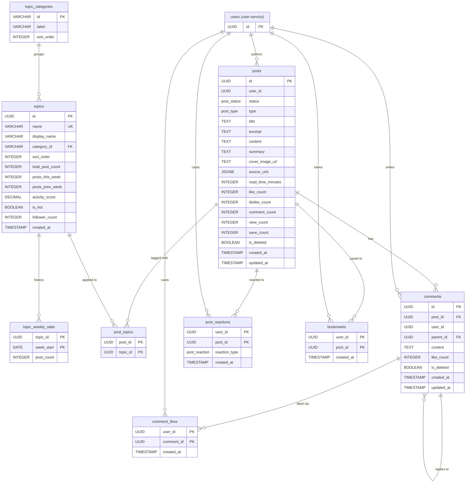

# Content Service — Database Schema

> This service owns posts, comments, topics, and the per-user interactions on
> content (likes/dislikes, comment likes, bookmarks). Cross-service references
> (the author `user_id`) are stored as `UUID` with **no** database-level foreign
> keys — they are resolved via user-service API calls. Foreign keys *within* this
> service (post ↔ comment ↔ topic) are real.
>

---

## Enumerations

| Enum Name       | Values               | Notes                                                        |
| --------------- | -------------------- | ----------------------------------------------------------- |
| `post_status`   | `DRAFT`, `PUBLISHED` | Drafts are private to the author                            |
| `post_type`     | `NORMAL`, `DIGEST`   | `DIGEST` = genai-generated AI Digest post (Epic 3 / P1)     |
| `post_reaction` | `LIKE`, `DISLIKE`    | Posts only; comments support likes only                    |

> Stored as strings (`@Enumerated(EnumType.STRING)`), not native PostgreSQL enum types.

---

## Tables

### `posts`

User-generated posts (and genai-generated digest posts).

| Column              | Type          | Nullable | Default             | Description                                            |
| ------------------- | ------------- | -------- | ------------------- | ------------------------------------------------------ |
| `id`                | `UUID`        | NO       | `gen_random_uuid()` | Primary key                                            |
| `user_id`           | `UUID`        | NO       |                     | Cross-service ref → user-service `users.id` (author)   |
| `status`            | `post_status` | NO       | `'DRAFT'`           | Draft or published (fail-closed: never auto-publish)  |
| `type`              | `post_type`   | NO       | `'NORMAL'`          | Normal post or AI Digest post                         |
| `title`             | `TEXT`        | NO       |                     | Post title (5–100 chars)                              |
| `excerpt`           | `TEXT`        | YES      |                     | Short feed-card preview; auto-generated from content if omitted |
| `content`           | `TEXT`        | NO       |                     | Full post body (Markdown)                             |
| `summary`           | `TEXT`        | YES      |                     | AI-generated summary (populated by genai-service)     |
| `cover_image_url`   | `TEXT`        | YES      |                     | Cover image URL                                       |
| `source_urls`       | `JSONB`       | YES      |                     | List of external source links (the "Sources" section) |
| `read_time_minutes` | `INTEGER`     | YES      |                     | Estimated read time, computed from content at write   |
| `like_count`        | `INTEGER`     | NO       | `0`                 | Denormalized cache                                    |
| `dislike_count`     | `INTEGER`     | NO       | `0`                 | Denormalized cache                                    |
| `comment_count`     | `INTEGER`     | NO       | `0`                 | Denormalized cache                                    |
| `view_count`        | `INTEGER`     | NO       | `0`                 | Denormalized cache                                    |
| `save_count`        | `INTEGER`     | NO       | `0`                 | Denormalized bookmark count                           |
| `is_deleted`        | `BOOLEAN`     | NO       | `false`             | Soft-delete flag                                     |
| `created_at`        | `TIMESTAMP`   | NO       | `CURRENT_TIMESTAMP` | Creation timestamp                                  |
| `updated_at`        | `TIMESTAMP`   | NO       | `CURRENT_TIMESTAMP` | Last edit timestamp                                 |

**Constraints:**

- `PK` on `id`
- `user_id` — no FK (cross-service UUID)

---

### `topic_categories`

Curated groupings for the topic picker / Manage-Topics page (admin-configurable).

| Column       | Type           | Nullable | Default | Description                                  |
| ------------ | -------------- | -------- | ------- | -------------------------------------------- |
| `id`         | `VARCHAR(50)`  | NO       |         | Primary key (slug, e.g. `research`, `models`) |
| `label`      | `VARCHAR(100)` | NO       |         | Display label, e.g. `Models & Labs`          |
| `sort_order` | `INTEGER`      | NO       | `0`     | Category display order                       |

**Constraints:**

- `PK` on `id`

---

### `topics`

Topic tags applied to posts (e.g. `#OpenAI`, `#LangChain`). Stats columns are
*cached* and refreshed by a nightly cron (see the note under `topic_weekly_stats`).

| Column             | Type           | Nullable | Default             | Description                                       |
| ------------------ | -------------- | -------- | ------------------- | ------------------------------------------------- |
| `id`               | `UUID`         | NO       | `gen_random_uuid()` | Primary key (the cross-service identifier)         |
| `name`             | `VARCHAR(50)`  | NO       |                     | Unique slug, e.g. `machine-learning`              |
| `display_name`     | `VARCHAR(100)` | NO       |                     | Human-readable label, e.g. `Machine Learning`     |
| `category_id`      | `VARCHAR(50)`  | YES      |                     | FK → `topic_categories.id`                        |
| `sort_order`       | `INTEGER`      | NO       | `0`                 | Display order within category                      |
| `total_post_count` | `INTEGER`      | NO       | `0`                 | Cached: total posts using this topic              |
| `posts_this_week`  | `INTEGER`      | NO       | `0`                 | Cached: posts in the rolling last 7 days          |
| `posts_prev_week`  | `INTEGER`      | NO       | `0`                 | Cached: posts in the prior 7 days                 |
| `activity_score`   | `DECIMAL(4,3)` | NO       | `0`                 | Cached: normalized activity 0.000–1.000           |
| `is_hot`           | `BOOLEAN`      | NO       | `false`             | Cached: trending flag                             |
| `follower_count`   | `INTEGER`      | NO       | `0`                 | Cached: subscriber count (synced from reco-service) |
| `created_at`       | `TIMESTAMP`    | NO       | `CURRENT_TIMESTAMP` | Creation timestamp                                |

**Constraints:**

- `PK` on `id`
- `UNIQUE` on `name`
- `FK` `category_id` → `topic_categories(id)` ON DELETE SET NULL

---

### `topic_weekly_stats`

8-week rolling history of per-topic weekly post counts, used to compute trend
(`posts_this_week` / `posts_prev_week` / `activity_score` / `is_hot`).

| Column       | Type      | Nullable | Default | Description                        |
| ------------ | --------- | -------- | ------- | ---------------------------------- |
| `topic_id`   | `UUID`    | NO       |         | FK → `topics.id`                   |
| `week_start` | `DATE`    | NO       |         | Monday of the week                 |
| `post_count` | `INTEGER` | NO       | `0`     | Posts created in that week         |

**Constraints:**

- `PK` on `(topic_id, week_start)` — composite
- `FK` `topic_id` → `topics(id)` ON DELETE CASCADE

> **Nightly cron (~00:05)** maintains the cached topic stats: writes the current
> week's bucket here; recomputes `posts_this_week` (rolling 7 days) and
> `posts_prev_week` (prior 7 days); sets `activity_score = posts_this_week / max(posts_this_week)`;
> sets `is_hot = posts_this_week >= 20 AND this_week/prev_week > 1.5`; purges rows
> older than 8 weeks. This replaces computing Epic 5 / P1 past-week growth on the fly.
>
> **`follower_count`** is synced from recommendation-service: topic subscriptions
> live there (one shared set for both feed and digest — no separate `digestTopics`),
> and subscribe/unsubscribe calls a content-service endpoint to adjust the count
> (OpenAPI gap: `POST /api/v1/topics/follower-counts`).

---

### `post_topics`

Many-to-many link between posts and topics.

| Column     | Type   | Nullable | Description       |
| ---------- | ------ | -------- | ----------------- |
| `post_id`  | `UUID` | NO       | FK → `posts.id`   |
| `topic_id` | `UUID` | NO       | FK → `topics.id`  |

**Constraints:**

- `PK` on `(post_id, topic_id)` — composite
- `FK` `post_id` → `posts(id)` ON DELETE CASCADE
- `FK` `topic_id` → `topics(id)` ON DELETE CASCADE

---

### `comments`

Comments on posts, with self-referential threading for replies.

| Column        | Type        | Nullable | Default             | Description                                          |
| ------------- | ----------- | -------- | ------------------- | ---------------------------------------------------- |
| `id`          | `UUID`      | NO       | `gen_random_uuid()` | Primary key                                          |
| `post_id`     | `UUID`      | NO       |                     | FK → `posts.id`                                     |
| `user_id`     | `UUID`      | NO       |                     | Cross-service ref → user-service `users.id` (author) |
| `parent_id`   | `UUID`      | YES      |                     | FK → `comments.id`; null for top-level comments     |
| `content`     | `TEXT`      | NO       |                     | Comment body                                        |
| `like_count`  | `INTEGER`   | NO       | `0`                 | Denormalized cache                                  |
| `is_deleted`  | `BOOLEAN`   | NO       | `false`             | Soft-delete flag (keeps reply threads intact)       |
| `created_at`  | `TIMESTAMP` | NO       | `CURRENT_TIMESTAMP` | Creation timestamp                                 |
| `updated_at`  | `TIMESTAMP` | NO       | `CURRENT_TIMESTAMP` | Last edit timestamp                                |

**Constraints:**

- `PK` on `id`
- `FK` `post_id` → `posts(id)` ON DELETE CASCADE
- `FK` `parent_id` → `comments(id)` ON DELETE CASCADE
- `user_id` — no FK (cross-service UUID)

---

### `post_reactions`

A user's like/dislike on a post (one reaction per user per post).

| Column          | Type            | Nullable | Default             | Description                                |
| --------------- | --------------- | -------- | ------------------- | ------------------------------------------ |
| `user_id`       | `UUID`          | NO       |                     | Cross-service ref → user-service `users.id` |
| `post_id`       | `UUID`          | NO       |                     | FK → `posts.id`                            |
| `reaction_type` | `post_reaction` | NO       |                     | `LIKE` or `DISLIKE`                        |
| `created_at`    | `TIMESTAMP`     | NO       | `CURRENT_TIMESTAMP` | Reaction timestamp                         |

**Constraints:**

- `PK` on `(user_id, post_id)` — composite, one reaction per user per post
- `FK` `post_id` → `posts(id)` ON DELETE CASCADE
- `user_id` — no FK (cross-service UUID)

---

### `comment_likes`

A user's like on a comment (likes only — no dislike on comments).

| Column       | Type        | Nullable | Default             | Description                                |
| ------------ | ----------- | -------- | ------------------- | ------------------------------------------ |
| `user_id`    | `UUID`      | NO       |                     | Cross-service ref → user-service `users.id` |
| `comment_id` | `UUID`      | NO       |                     | FK → `comments.id`                         |
| `created_at` | `TIMESTAMP` | NO       | `CURRENT_TIMESTAMP` | Like timestamp                             |

**Constraints:**

- `PK` on `(user_id, comment_id)` — composite, one like per user per comment
- `FK` `comment_id` → `comments(id)` ON DELETE CASCADE
- `user_id` — no FK (cross-service UUID)

---

### `bookmarks`

A user's saved posts.

| Column       | Type        | Nullable | Default             | Description                                |
| ------------ | ----------- | -------- | ------------------- | ------------------------------------------ |
| `user_id`    | `UUID`      | NO       |                     | Cross-service ref → user-service `users.id` |
| `post_id`    | `UUID`      | NO       |                     | FK → `posts.id`                            |
| `created_at` | `TIMESTAMP` | NO       | `CURRENT_TIMESTAMP` | Bookmark timestamp                         |

**Constraints:**

- `PK` on `(user_id, post_id)` — composite, one bookmark per user per post
- `FK` `post_id` → `posts(id)` ON DELETE CASCADE
- `user_id` — no FK (cross-service UUID)

---

## Entity-Relationship Diagram

---

## Indexes

| Table            | Index                                     | Type   | Purpose                                |
| ---------------- | ----------------------------------------- | ------ | -------------------------------------- |
| `posts`          | `idx_posts_user_status` (`user_id, status`) | B-TREE | Author's posts; drafts vs published    |
| `posts`          | `idx_posts_created_at`                     | B-TREE | Chronological listing; topic growth    |
| `topics`         | `idx_topics_name`                         | UNIQUE | Topic lookup / dedupe by slug          |
| `topics`         | `idx_topics_category_id`                  | B-TREE | Topics grouped by category             |
| `post_topics`    | `idx_post_topics_topic_id`                | B-TREE | Posts in a topic; topic post counts    |
| `comments`       | `idx_comments_post_id`                    | B-TREE | Comments per post                      |
| `comments`       | `idx_comments_parent_id`                  | B-TREE | Threaded reply lookup                  |
| `post_reactions` | `idx_post_reactions_post_id`              | B-TREE | Reaction counts per post               |
| `comment_likes`  | `idx_comment_likes_comment_id`            | B-TREE | Like counts per comment                |
| `bookmarks`      | `idx_bookmarks_post_id`                   | B-TREE | Save count per post                    |

> Composite-PK tables (`post_reactions`, `comment_likes`, `bookmarks`) already index
> their leading `user_id` column (for "my likes / my bookmarks" lookups); the extra
> indexes above cover the reverse-direction (per-post / per-comment) lookups.

---
