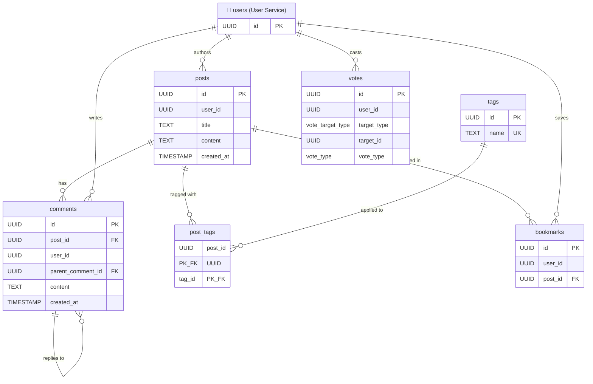

# Content Service — Database Schema

> [!NOTE]
> Tables marked with 🔗 are **external references** from another service's database.
> Cross-service IDs (e.g. `user_id`) are stored as `UUID` but have **no database-level FK constraint**.
> Data is resolved via inter-service API calls.

---

## Enumerations

| Enum Name          | Values               |
| ------------------ | -------------------- |
| `vote_target_type` | `POST`, `COMMENT`    |
| `vote_type`        | `UPVOTE`, `DOWNVOTE` |

---

## Tables

### `posts`

Stores user-generated content posts.

| Column            | Type        | Nullable | Default             | Description                                      |
| ----------------- | ----------- | -------- | ------------------- | ------------------------------------------------ |
| `id`              | `UUID`      | NO       | `gen_random_uuid()` | Primary key                                      |
| `user_id`         | `UUID`      | NO       |                     | 🔗 Cross-service ref → User Service `users.id`   |
| `title`           | `TEXT`      | NO       |                     | Post title                                       |
| `content`         | `TEXT`      | NO       |                     | Full post content (markdown)                     |
| `content_summary` | `TEXT`      | YES      |                     | AI-generated summary                             |
| `source_url`      | `TEXT`      | YES      |                     | External source link                             |
| `cover_image_url` | `TEXT`      | YES      |                     | Cover image URL (stored in object storage)       |
| `view_count`      | `INTEGER`   | NO       | `0`                 | Total view count                                 |
| `upvote_count`    | `INTEGER`   | NO       | `0`                 | Total upvotes                                    |
| `downvote_count`  | `INTEGER`   | NO       | `0`                 | Total downvotes                                  |
| `comment_count`   | `INTEGER`   | NO       | `0`                 | Total comments                                   |
| `created_at`      | `TIMESTAMP` | NO       | `CURRENT_TIMESTAMP` | Post creation timestamp                          |
| `updated_at`      | `TIMESTAMP` | NO       | `CURRENT_TIMESTAMP` | Last edit timestamp                              |

**Constraints:**

- `PK` on `id`
- ⚠️ `user_id` has **no FK constraint** — resolved via User Service API

---

### `comments`

Stores comments on posts, with support for nested replies.

| Column              | Type        | Nullable | Default             | Description                                    |
| ------------------- | ----------- | -------- | ------------------- | ---------------------------------------------- |
| `id`                | `UUID`      | NO       | `gen_random_uuid()` | Primary key                                    |
| `post_id`           | `UUID`      | NO       |                     | FK → `posts.id`                                |
| `user_id`           | `UUID`      | NO       |                     | 🔗 Cross-service ref → User Service `users.id` |
| `parent_comment_id` | `UUID`      | YES      |                     | FK → `comments.id` (self-ref for replies)      |
| `content`           | `TEXT`      | NO       |                     | Comment body                                   |
| `upvote_count`      | `INTEGER`   | NO       | `0`                 | Total upvotes on this comment                  |
| `created_at`        | `TIMESTAMP` | NO       | `CURRENT_TIMESTAMP` | Comment creation timestamp                     |
| `updated_at`        | `TIMESTAMP` | NO       | `CURRENT_TIMESTAMP` | Last edit timestamp                            |

**Constraints:**

- `PK` on `id`
- `FK` `post_id` → `posts(id)` ON DELETE CASCADE
- `FK` `parent_comment_id` → `comments(id)` ON DELETE CASCADE
- ⚠️ `user_id` has **no FK constraint** — resolved via User Service API

---

### `tags`

Topic tags that can be associated with posts.

| Column        | Type        | Nullable | Default             | Description             |
| ------------- | ----------- | -------- | ------------------- | ----------------------- |
| `id`          | `UUID`      | NO       | `gen_random_uuid()` | Primary key             |
| `name`        | `TEXT`      | NO       |                     | Unique tag name         |
| `description` | `TEXT`      | YES      |                     | Tag description         |
| `post_count`  | `INTEGER`   | NO       | `0`                 | Denormalized post count |
| `created_at`  | `TIMESTAMP` | NO       | `CURRENT_TIMESTAMP` | Tag creation timestamp  |

**Constraints:**

- `PK` on `id`
- `UNIQUE` on `name`

---

### `post_tags` (Join Table)

Many-to-many relationship between posts and tags.

| Column    | Type   | Nullable | Description      |
| --------- | ------ | -------- | ---------------- |
| `post_id` | `UUID` | NO       | FK → `posts.id`  |
| `tag_id`  | `UUID` | NO       | FK → `tags.id`   |

**Constraints:**

- `PK` on `(post_id, tag_id)` — composite primary key
- `FK` `post_id` → `posts(id)` ON DELETE CASCADE
- `FK` `tag_id` → `tags(id)` ON DELETE CASCADE

---

### `votes`

Stores upvotes/downvotes on posts and comments (polymorphic target).

| Column        | Type               | Nullable | Default             | Description                                    |
| ------------- | ------------------ | -------- | ------------------- | ---------------------------------------------- |
| `id`          | `UUID`             | NO       | `gen_random_uuid()` | Primary key                                    |
| `user_id`     | `UUID`             | NO       |                     | 🔗 Cross-service ref → User Service `users.id` |
| `target_type` | `vote_target_type` | NO       |                     | `POST` or `COMMENT`                            |
| `target_id`   | `UUID`             | NO       |                     | ID of the voted post or comment                |
| `vote_type`   | `vote_type`        | NO       |                     | `UPVOTE` or `DOWNVOTE`                         |
| `created_at`  | `TIMESTAMP`        | NO       | `CURRENT_TIMESTAMP` | Vote timestamp                                 |

**Constraints:**

- `PK` on `id`
- `UNIQUE` on `(user_id, target_type, target_id)` — one vote per user per target
- ⚠️ `user_id` has **no FK constraint** — resolved via User Service API

---

### `bookmarks`

Stores user-saved posts.

| Column       | Type        | Nullable | Default             | Description                                    |
| ------------ | ----------- | -------- | ------------------- | ---------------------------------------------- |
| `id`         | `UUID`      | NO       | `gen_random_uuid()` | Primary key                                    |
| `user_id`    | `UUID`      | NO       |                     | 🔗 Cross-service ref → User Service `users.id` |
| `post_id`    | `UUID`      | NO       |                     | FK → `posts.id`                                |
| `created_at` | `TIMESTAMP` | NO       | `CURRENT_TIMESTAMP` | Bookmark timestamp                             |

**Constraints:**

- `PK` on `id`
- `FK` `post_id` → `posts(id)` ON DELETE CASCADE
- `UNIQUE` on `(user_id, post_id)` — one bookmark per user per post
- ⚠️ `user_id` has **no FK constraint** — resolved via User Service API

---

## Entity-Relationship Diagram

---

## Indexes

| Table       | Index                                                       | Type   | Purpose                 |
| ----------- | ----------------------------------------------------------- | ------ | ----------------------- |
| `posts`     | `idx_posts_user_id`                                         | B-TREE | Posts by author          |
| `posts`     | `idx_posts_created_at`                                      | B-TREE | Chronological feed      |
| `comments`  | `idx_comments_post_id`                                      | B-TREE | Comments per post       |
| `comments`  | `idx_comments_user_id`                                      | B-TREE | Comments by user        |
| `comments`  | `idx_comments_parent_comment_id`                            | B-TREE | Threaded reply lookup   |
| `votes`     | `idx_votes_user_target` (`user_id, target_type, target_id`) | UNIQUE | Prevent duplicate votes |
| `votes`     | `idx_votes_target` (`target_type, target_id`)               | B-TREE | Vote counts per target  |
| `bookmarks` | `idx_bookmarks_user_post` (`user_id, post_id`)              | UNIQUE | Prevent duplicate saves |
| `bookmarks` | `idx_bookmarks_user_id`                                     | B-TREE | User's saved posts      |
