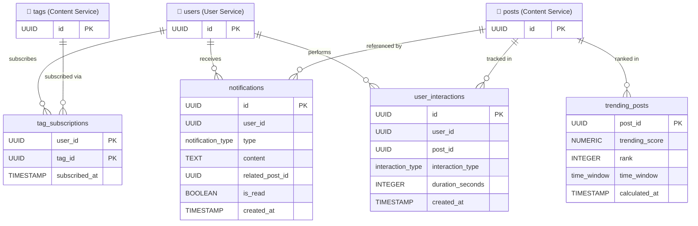

# Recommendation Service — Database Schema

> [!NOTE]
> Tables marked with 🔗 are **external references** from another service's database.
> Cross-service IDs are stored as `UUID` but have **no database-level FK constraint**.
> Data is resolved via inter-service API calls.

---

## Enumerations

| Enum Name           | Values                                                                             |
| ------------------- | ---------------------------------------------------------------------------------- |
| `interaction_type`  | `VIEW`, `CLICK`, `UPVOTE`, `COMMENT`, `BOOKMARK`                                  |
| `time_window`       | `HOUR`, `DAY`, `WEEK`                                                              |
| `notification_type` | `COMMENT`, `UPVOTE`, `VERIFICATION_APPROVED`, `DAILY_DIGEST`, `NEW_POST_IN_SUBSCRIBED_TAG` |

---

## Tables

### `user_interactions`

Tracks user behavior for analytics and the recommendation engine.

| Column             | Type               | Nullable | Default             | Description                                       |
| ------------------ | ------------------ | -------- | ------------------- | ------------------------------------------------- |
| `id`               | `UUID`             | NO       | `gen_random_uuid()` | Primary key                                       |
| `user_id`          | `UUID`             | NO       |                     | 🔗 Cross-service ref → User Service `users.id`    |
| `post_id`          | `UUID`             | NO       |                     | 🔗 Cross-service ref → Content Service `posts.id` |
| `interaction_type` | `interaction_type` | NO       |                     | Type of interaction                               |
| `duration_seconds` | `INTEGER`          | YES      |                     | Time spent (for VIEW events)                      |
| `created_at`       | `TIMESTAMP`        | NO       | `CURRENT_TIMESTAMP` | Interaction timestamp                             |

**Constraints:**

- `PK` on `id`
- ⚠️ `user_id` has **no FK constraint** — resolved via User Service API
- ⚠️ `post_id` has **no FK constraint** — resolved via Content Service API

---

### `tag_subscriptions`

Tracks which tags a user has subscribed to for notifications.

| Column          | Type        | Nullable | Default             | Description                                       |
| --------------- | ----------- | -------- | ------------------- | ------------------------------------------------- |
| `user_id`       | `UUID`      | NO       |                     | 🔗 Cross-service ref → User Service `users.id`    |
| `tag_id`        | `UUID`      | NO       |                     | 🔗 Cross-service ref → Content Service `tags.id`  |
| `subscribed_at` | `TIMESTAMP` | NO       | `CURRENT_TIMESTAMP` | Subscription timestamp                            |

**Constraints:**

- `PK` on `(user_id, tag_id)` — composite primary key
- ⚠️ `user_id` has **no FK constraint** — resolved via User Service API
- ⚠️ `tag_id` has **no FK constraint** — resolved via Content Service API

---

### `trending_posts`

Pre-computed trending post rankings per time window.

| Column           | Type          | Nullable | Default             | Description                                       |
| ---------------- | ------------- | -------- | ------------------- | ------------------------------------------------- |
| `post_id`        | `UUID`        | NO       |                     | 🔗 Cross-service ref → Content Service `posts.id` |
| `trending_score` | `NUMERIC`     | NO       |                     | Calculated trending score                         |
| `rank`           | `INTEGER`     | NO       |                     | Position in trending list                         |
| `time_window`    | `time_window` | NO       |                     | `HOUR`, `DAY`, or `WEEK`                          |
| `calculated_at`  | `TIMESTAMP`   | NO       | `CURRENT_TIMESTAMP` | When the score was last computed                  |

**Constraints:**

- `PK` on `(post_id, time_window)` — composite primary key
- ⚠️ `post_id` has **no FK constraint** — resolved via Content Service API

---

### `notifications`

In-app notifications delivered to users.

| Column            | Type                | Nullable | Default             | Description                                       |
| ----------------- | ------------------- | -------- | ------------------- | ------------------------------------------------- |
| `id`              | `UUID`              | NO       | `gen_random_uuid()` | Primary key                                       |
| `user_id`         | `UUID`              | NO       |                     | 🔗 Cross-service ref → User Service `users.id`    |
| `type`            | `notification_type` | NO       |                     | Notification category                             |
| `content`         | `TEXT`              | NO       |                     | Notification message                              |
| `related_post_id` | `UUID`              | YES      |                     | 🔗 Cross-service ref → Content Service `posts.id` |
| `is_read`         | `BOOLEAN`           | NO       | `FALSE`             | Read status                                       |
| `created_at`      | `TIMESTAMP`         | NO       | `CURRENT_TIMESTAMP` | Notification timestamp                            |

**Constraints:**

- `PK` on `id`
- ⚠️ `user_id` has **no FK constraint** — resolved via User Service API
- ⚠️ `related_post_id` has **no FK constraint** — resolved via Content Service API

---

## Entity-Relationship Diagram

---

## Indexes

| Table                | Index                                            | Type   | Purpose                |
| -------------------- | ------------------------------------------------ | ------ | ---------------------- |
| `user_interactions`  | `idx_interactions_user_id`                       | B-TREE | Interactions per user  |
| `user_interactions`  | `idx_interactions_post_id`                       | B-TREE | Interactions per post  |
| `user_interactions`  | `idx_interactions_created_at`                    | B-TREE | Time-range analytics   |
| `tag_subscriptions`  | `idx_tag_subs_user_id`                           | B-TREE | User's subscriptions   |
| `trending_posts`     | `idx_trending_window_rank` (`time_window, rank`) | B-TREE | Trending feed queries  |
| `notifications`      | `idx_notif_user_read` (`user_id, is_read`)       | B-TREE | Unread notifications   |
| `notifications`      | `idx_notif_created_at`                           | B-TREE | Chronological feed     |
