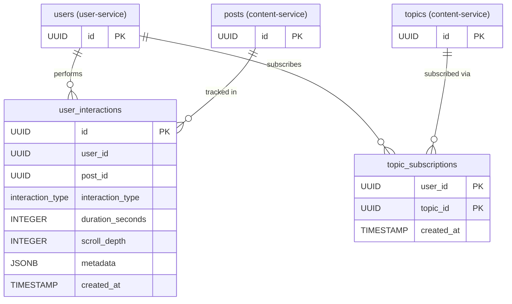

# Recommendation Service — Database Schema

> This service owns discovery (personal + trending feeds), topic subscriptions, and
> behavioral interaction tracking. Cross-service references (users, posts, topics)
> are stored as `UUID` with **no** database-level foreign keys — they are resolved
> via inter-service API calls.
>

---

## Enumerations

| Enum Name          | Values                                     | Notes                                       |
| ------------------ | ------------------------------------------ | ------------------------------------------- |
| `interaction_type` | `CLICK`, `VIEW`, `DWELL`, `SCROLL`, `SHARE` | Matches `InteractionRequest.interactionType` |

> Stored as strings (`@Enumerated(EnumType.STRING)`), not native PostgreSQL enum types.

---

## Tables

### `user_interactions`

Implicit behavioral signals feeding the personalized feed (`POST /api/v1/interactions/track`).

| Column             | Type               | Nullable | Default             | Description                                       |
| ------------------ | ------------------ | -------- | ------------------- | ------------------------------------------------- |
| `id`               | `UUID`             | NO       | `gen_random_uuid()` | Primary key                                       |
| `user_id`          | `UUID`             | NO       |                     | Cross-service ref → user-service `users.id`       |
| `post_id`          | `UUID`             | NO       |                     | Cross-service ref → content-service `posts.id`    |
| `interaction_type` | `interaction_type` | NO       |                     | Type of behavioral signal                         |
| `duration_seconds` | `INTEGER`          | YES      |                     | Seconds in viewport; relevant for `DWELL`         |
| `scroll_depth`     | `INTEGER`          | YES      |                     | Scroll percentage (0–100); relevant for `SCROLL`  |
| `metadata`         | `JSONB`            | YES      |                     | Optional free-form event context                  |
| `created_at`       | `TIMESTAMP`        | NO       | `CURRENT_TIMESTAMP` | Event timestamp                                   |

**Constraints:**

- `PK` on `id`
- `user_id`, `post_id` — no FK (cross-service UUIDs)

---

### `topic_subscriptions`

Topics a user follows. Drives the personalized feed.

| Column       | Type        | Nullable | Default             | Description                                     |
| ------------ | ----------- | -------- | ------------------- | ----------------------------------------------- |
| `user_id`    | `UUID`      | NO       |                     | Cross-service ref → user-service `users.id`     |
| `topic_id`   | `UUID`      | NO       |                     | Cross-service ref → content-service `topics.id` |
| `created_at` | `TIMESTAMP` | NO       | `CURRENT_TIMESTAMP` | Subscription timestamp                          |

**Constraints:**

- `PK` on `(user_id, topic_id)` — composite, prevents duplicate subscriptions
- `user_id`, `topic_id` — no FK (cross-service UUIDs)

> Topic `name` (returned by `getSubscribedTopics`) is resolved from content-service;
> only the `topic_id` is stored here.

---

## Entity-Relationship Diagram

---

## Indexes

| Table                 | Index                         | Type   | Purpose                         |
| --------------------- | ----------------------------- | ------ | ------------------------------- |
| `user_interactions`   | `idx_interactions_user_id`    | B-TREE | Per-user signal lookup          |
| `user_interactions`   | `idx_interactions_post_id`    | B-TREE | Per-post engagement aggregation |
| `user_interactions`   | `idx_interactions_created_at` | B-TREE | Time-range / recency analytics  |
| `topic_subscriptions` | `idx_topic_subs_topic_id`     | B-TREE | Fan-out by topic                |

> `topic_subscriptions` already indexes `user_id` from its composite PK's leading
> column; the extra index covers the reverse-direction (by topic) lookup.
