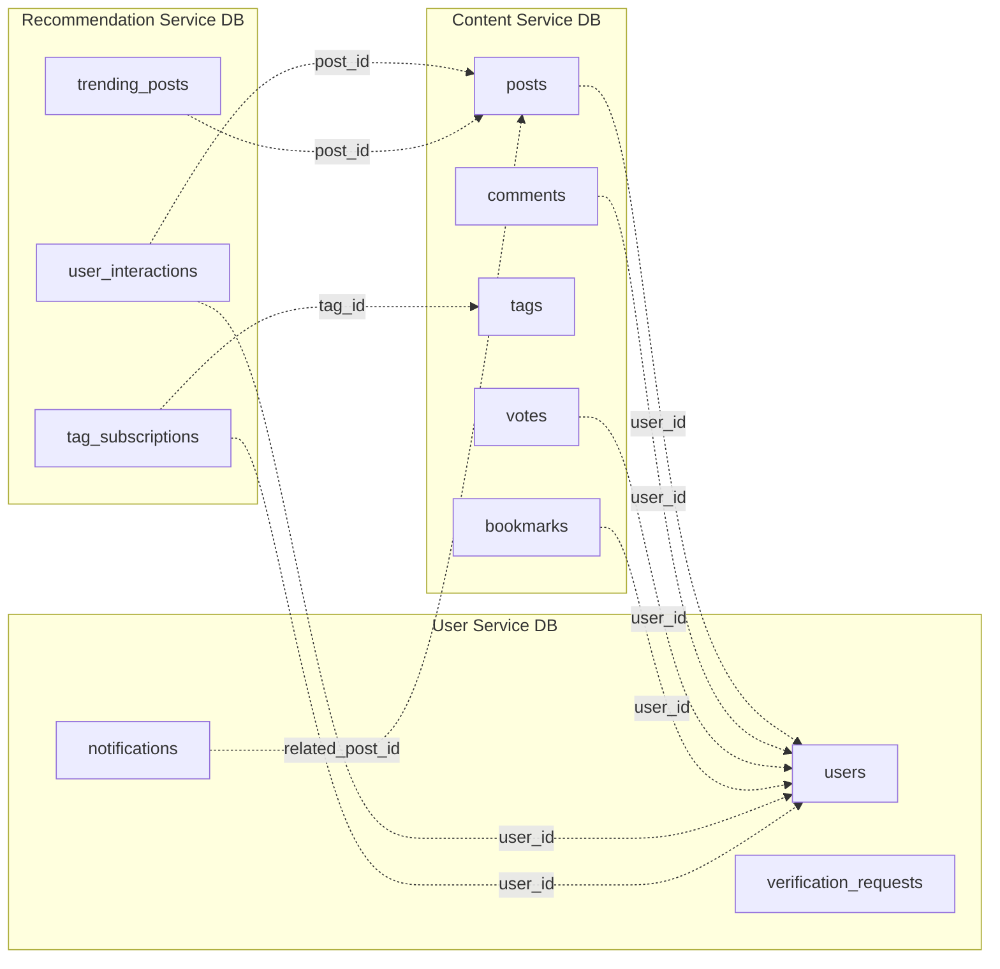

# Database Schema — Overview

> Derived from [Class Diagram v2](../diagrams/Class%20Diagram%20v2.json)

Each microservice owns its own PostgreSQL database. Cross-service references store `UUID` values but have **no database-level foreign key constraints** — data integrity is maintained at the application layer via API calls.

---

## Service Schema Files

| Service                  | Schema File                                                          | Tables                                                                  |
| ------------------------ | -------------------------------------------------------------------- | ----------------------------------------------------------------------- |
| **User Service**         | [user_service_schema.md](./user_service_schema.md)                   | `users`, `verification_requests`, `notifications`                       |
| **Content Service**      | [content_service_schema.md](./content_service_schema.md)             | `posts`, `comments`, `tags`, `post_tags`, `votes`, `bookmarks`          |
| **Recommendation Service** | [recommendation_service_schema.md](./recommendation_service_schema.md) | `user_interactions`, `tag_subscriptions`, `trending_posts`            |

---

## Cross-Service Reference Map

> **Legend:** Dashed arrows (`-.->`) represent cross-service UUID references (no DB-level FK).

---

## Conventions

| Convention         | Detail                                                      |
| ------------------ | ----------------------------------------------------------- |
| **Primary Keys**   | `UUID` with `gen_random_uuid()` default                     |
| **String columns** | `TEXT` (PostgreSQL treats `TEXT` and `VARCHAR` identically)  |
| **Timestamps**     | `TIMESTAMP` with `CURRENT_TIMESTAMP` default                |
| **Enums**          | PostgreSQL custom enum types, scoped per service database   |
| **Cross-service**  | Marked with 🔗 in column descriptions, no FK constraint     |
