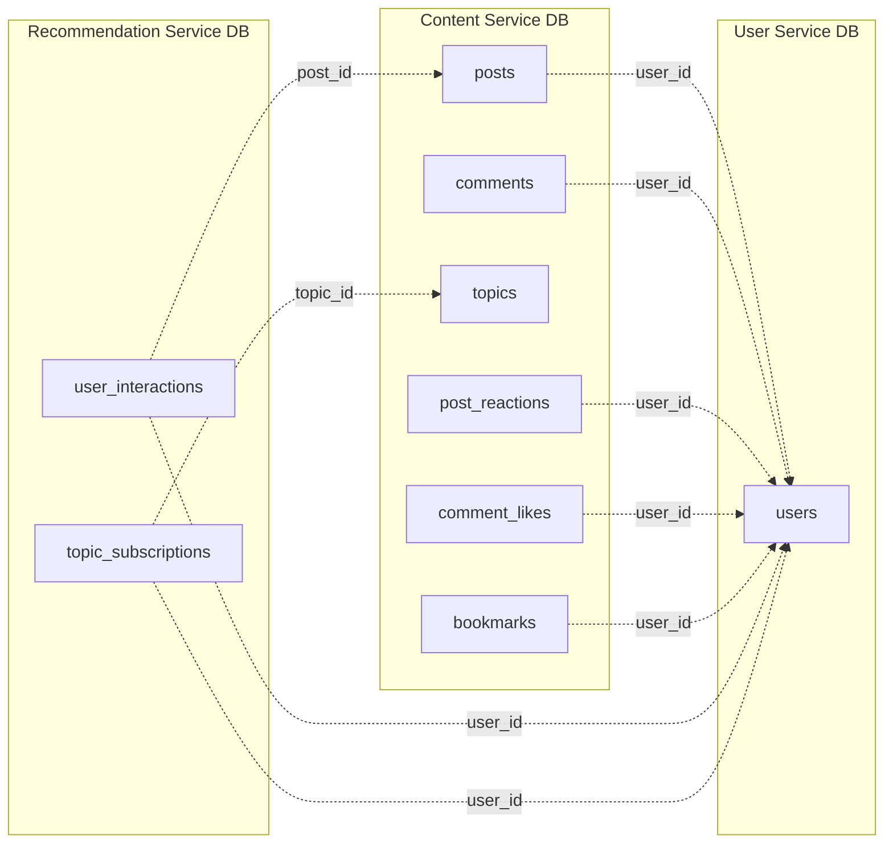

# Database Schema — Overview

Each microservice owns its own PostgreSQL database. Cross-service references store `UUID` values but have **no database-level foreign key constraints** — integrity is maintained at the application layer via API calls.

This overview reflects the baseline (P0/P1) design. P2-only tables are noted but not modeled in the per-service docs.

---

## Service Schema Files

| Service                  | Schema File                                                          | Tables                                                                                                  |
| ------------------------ | -------------------------------------------------------------------- | ------------------------------------------------------------------------------------------------------ |
| **User Service**         | [user_service_schema.md](./user_service_schema.md)                   | `users`                                                                                                 |
| **Content Service**      | [content_service_schema.md](./content_service_schema.md)             | `posts`, `comments`, `topics`, `topic_categories`, `topic_weekly_stats`, `post_topics`, `post_reactions`, `comment_likes`, `bookmarks` |
| **Recommendation Service** | [recommendation_service_schema.md](./recommendation_service_schema.md) | `user_interactions`, `topic_subscriptions`  (P2 optional: `user_follows`, `notifications`)         |

---

## Cross-Service Reference Map

> **Legend:** Dashed arrows (`-.->`) are cross-service UUID references (no DB-level FK).
> Within a service, references (e.g. `post_topics` → `posts`/`topics`, `comments` → `posts`) are real foreign keys — see each service's schema doc.

---

## Conventions

| Convention         | Detail                                                                            |
| ------------------ | -------------------------------------------------------------------------------- |
| **Primary Keys**   | `UUID` with `gen_random_uuid()` default (except curated `topic_categories.id`, a slug) |
| **String columns** | `TEXT` by default; `VARCHAR(n)` where a length cap is meaningful (e.g. topic slug/label) |
| **Timestamps**     | `TIMESTAMP` with `CURRENT_TIMESTAMP` default                                     |
| **Enums**          | Stored as strings via `@Enumerated(EnumType.STRING)` — **not** native PostgreSQL enum types |
| **Cross-service**  | Stored as plain `UUID`, no FK constraint; resolved via inter-service API calls   |
| **Soft delete**    | Content uses `is_deleted` flags (posts, comments) rather than hard deletes       |
