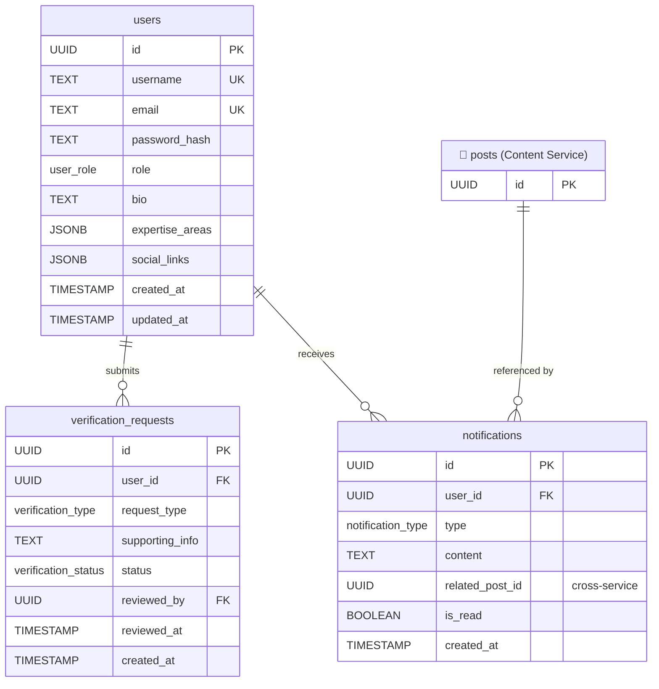

# User Service — Database Schema

> [!NOTE]
> Tables marked with 🔗 are **external references** from another service's database.
> Cross-service IDs (e.g. `related_post_id`) are stored as `UUID` but have **no database-level FK constraint**.
> Data is resolved via inter-service API calls.

---

## Enumerations

| Enum Name             | Values                                                                             |
| --------------------- | ---------------------------------------------------------------------------------- |
| `user_role`           | `USER`, `ADMIN`, `VERIFIED`                                                        |
| `verification_type`   | `ORGANIZATION`, `EXPERT`                                                           |
| `verification_status` | `PENDING`, `APPROVED`, `REJECTED`                                                  |
| `notification_type`   | `COMMENT`, `UPVOTE`, `VERIFICATION_APPROVED`, `DAILY_DIGEST`, `NEW_POST_IN_SUBSCRIBED_TAG` |

---

## Tables

### `users`

Stores user accounts and profile information.

| Column            | Type        | Nullable | Default              | Description                         |
| ----------------- | ----------- | -------- | -------------------- | ----------------------------------- |
| `id`              | `UUID`      | NO       | `gen_random_uuid()`  | Primary key                         |
| `username`        | `TEXT`      | NO       |                      | Unique display name                 |
| `email`           | `TEXT`      | NO       |                      | Unique email address                |
| `password_hash`   | `TEXT`      | NO       |                      | Hashed password                     |
| `role`            | `user_role` | NO       | `'USER'`             | User role enum                      |
| `bio`             | `TEXT`      | YES      |                      | Short biography                     |
| `expertise_areas` | `JSONB`     | YES      |                      | Array of expertise area strings     |
| `social_links`    | `JSONB`     | YES      |                      | Key-value map of social media links |
| `created_at`      | `TIMESTAMP` | NO       | `CURRENT_TIMESTAMP`  | Account creation timestamp          |
| `updated_at`      | `TIMESTAMP` | NO       | `CURRENT_TIMESTAMP`  | Last profile update timestamp       |

**Constraints:**

- `PK` on `id`
- `UNIQUE` on `username`
- `UNIQUE` on `email`

---

### `verification_requests`

Tracks user requests for verified status (organization or expert).

| Column            | Type                  | Nullable | Default             | Description                             |
| ----------------- | --------------------- | -------- | ------------------- | --------------------------------------- |
| `id`              | `UUID`                | NO       | `gen_random_uuid()` | Primary key                             |
| `user_id`         | `UUID`                | NO       |                     | FK → `users.id`                         |
| `request_type`    | `verification_type`   | NO       |                     | Type of verification requested          |
| `supporting_info` | `TEXT`                | YES      |                     | Evidence / justification text           |
| `status`          | `verification_status` | NO       | `'PENDING'`         | Current status of the request           |
| `reviewed_by`     | `UUID`                | YES      |                     | FK → `users.id` (admin who reviewed)    |
| `reviewed_at`     | `TIMESTAMP`           | YES      |                     | Timestamp when the request was reviewed |
| `created_at`      | `TIMESTAMP`           | NO       | `CURRENT_TIMESTAMP` | Submission timestamp                    |

**Constraints:**

- `PK` on `id`
- `FK` `user_id` → `users(id)` ON DELETE CASCADE
- `FK` `reviewed_by` → `users(id)` ON DELETE SET NULL

---

### `notifications`

In-app notifications delivered to users.

| Column            | Type                | Nullable | Default             | Description                                        |
| ----------------- | ------------------- | -------- | ------------------- | -------------------------------------------------- |
| `id`              | `UUID`              | NO       | `gen_random_uuid()` | Primary key                                        |
| `user_id`         | `UUID`              | NO       |                     | FK → `users.id` (recipient)                        |
| `type`            | `notification_type` | NO       |                     | Notification category                              |
| `content`         | `TEXT`              | NO       |                     | Notification message                               |
| `related_post_id` | `UUID`              | YES      |                     | 🔗 Cross-service ref → Content Service `posts.id`  |
| `is_read`         | `BOOLEAN`           | NO       | `FALSE`             | Read status                                        |
| `created_at`      | `TIMESTAMP`         | NO       | `CURRENT_TIMESTAMP` | Notification timestamp                             |

**Constraints:**

- `PK` on `id`
- `FK` `user_id` → `users(id)` ON DELETE CASCADE
- ⚠️ `related_post_id` has **no FK constraint** — resolved via Content Service API

---

## Entity-Relationship Diagram

---

## Indexes

| Table                   | Index                              | Type   | Purpose              |
| ----------------------- | ---------------------------------- | ------ | -------------------- |
| `users`                 | `idx_users_username`               | UNIQUE | Login lookup          |
| `users`                 | `idx_users_email`                  | UNIQUE | Email lookup          |
| `verification_requests` | `idx_verif_user_id`                | B-TREE | Requests per user     |
| `verification_requests` | `idx_verif_status`                 | B-TREE | Admin review queue    |
| `notifications`         | `idx_notif_user_read` (`user_id, is_read`) | B-TREE | Unread notifications |
| `notifications`         | `idx_notif_created_at`             | B-TREE | Chronological feed    |
