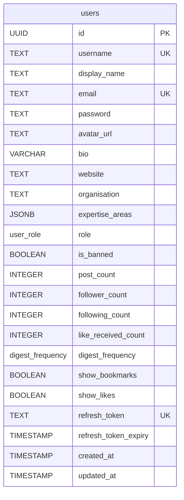

# User Service — Database Schema

> This service owns user identity, authentication, public profiles, account
> preferences, and admin role/ban management. Cross-service references use UUIDs
> only — there are **no** database-level foreign keys to other services.
>

---

## Enumerations

| Enum Name          | Values                      | Notes                              |
| ------------------ | --------------------------- | ---------------------------------- |
| `user_role`        | `USER`, `VERIFIED`, `ADMIN` | `VERIFIED` drives the badge        |
| `digest_frequency` | `DAILY`, `WEEKLY`, `OFF`    | AI Digest cadence; new accounts default to `DAILY` in the application |

> Stored as strings (`@Enumerated(EnumType.STRING)`), not native PostgreSQL enum types.

---

## Tables

### `users`

Stores user accounts, public profile fields, denormalized social counters,
auth/refresh-token state, and notification preferences.

| Column                 | Type           | Nullable | Default             | Description                                                  |
| ---------------------- | -------------- | -------- | ------------------- | ------------------------------------------------------------ |
| `id`                   | `UUID`         | NO       | `gen_random_uuid()` | Primary key                                                  |
| `username`             | `TEXT`         | NO       |                     | Unique login/handle (`^[a-zA-Z0-9_]+$`, 3–20 chars)          |
| `display_name`         | `TEXT`         | YES      |                     | Shown name; falls back to `username` if unset                |
| `email`                | `TEXT`         | NO       |                     | Unique email address                                         |
| `password`             | `TEXT`         | NO       |                     | Bcrypt hash — never returned in API responses               |
| `avatar_url`           | `TEXT`         | YES      |                     | Profile picture URL                                          |
| `bio`                  | `VARCHAR(1000)`| YES      |                     | Short biography (API validates ≤250 chars)                  |
| `website`              | `TEXT`         | YES      |                     | Single external link (reduced scope vs. multiple links)     |
| `organisation`         | `TEXT`         | YES      |                     | Affiliation / organisation                                  |
| `expertise_areas`      | `JSONB`        | YES      |                     | Flat array of expertise tags (e.g. `["LLMs","RAG"]`)        |
| `role`                 | `user_role`    | NO       | `'USER'`            | Access role                                                  |
| `is_banned`            | `BOOLEAN`      | NO       | `false`             | Admin ban flag                                              |
| `post_count`           | `INTEGER`      | NO       | `0`                 | Denormalized cache (see note)                               |
| `follower_count`       | `INTEGER`      | NO       | `0`                 | Denormalized cache (see note)                               |
| `following_count`      | `INTEGER`      | NO       | `0`                 | Denormalized cache (see note)                               |
| `like_received_count`  | `INTEGER`      | NO       | `0`                 | Denormalized cache (see note)                               |
| `digest_frequency`     | `digest_frequency` | NO   |                     | AI Digest cadence; new accounts start at `DAILY` in the application |
| `show_bookmarks`       | `BOOLEAN`      | NO       | `true`              | Whether others can see this user's bookmarks               |
| `show_likes`           | `BOOLEAN`      | NO       | `true`              | Whether others can see this user's liked posts             |
| `refresh_token`        | `TEXT`         | YES      |                     | Current refresh token (unique)                             |
| `refresh_token_expiry` | `TIMESTAMP`    | YES      |                     | Refresh token expiry                                        |
| `created_at`           | `TIMESTAMP`    | NO       | `CURRENT_TIMESTAMP` | Account creation timestamp                                  |
| `updated_at`           | `TIMESTAMP`    | NO       | `CURRENT_TIMESTAMP` | Last profile update timestamp                              |

**Constraints:**

- `PK` on `id`
- `UNIQUE` on `username`
- `UNIQUE` on `email`
- `UNIQUE` on `refresh_token`

> **Denormalized counters:** `post_count`, `follower_count`, `following_count`,
> and `like_received_count` are cached here for cheap profile reads. The source of
> truth lives in other services (posts/likes in content-service; follows in
> recommendation-service), so these are kept in sync via cross-service signals.
> They are flagged as currently unfillable in the gap analysis (Epic 4 / P2) until
> those count/list endpoints exist.

> **`expertise_areas`:** stored inline as a `JSONB` array rather than a separate
> table — it is a small, display-only string list (rendered as chips, edited as a
> comma-separated field on the frontend) and is never queried relationally.

---

## Entity-Relationship Diagram

---

## Indexes

| Table            | Index                  | Type   | Purpose               |
| ---------------- | ---------------------- | ------ | --------------------- |
| `users`          | `idx_users_username`   | UNIQUE | Login / handle lookup |
| `users`          | `idx_users_email`      | UNIQUE | Email lookup / login  |
| `users`          | `idx_users_refresh_token` | UNIQUE | Refresh-token rotation |
