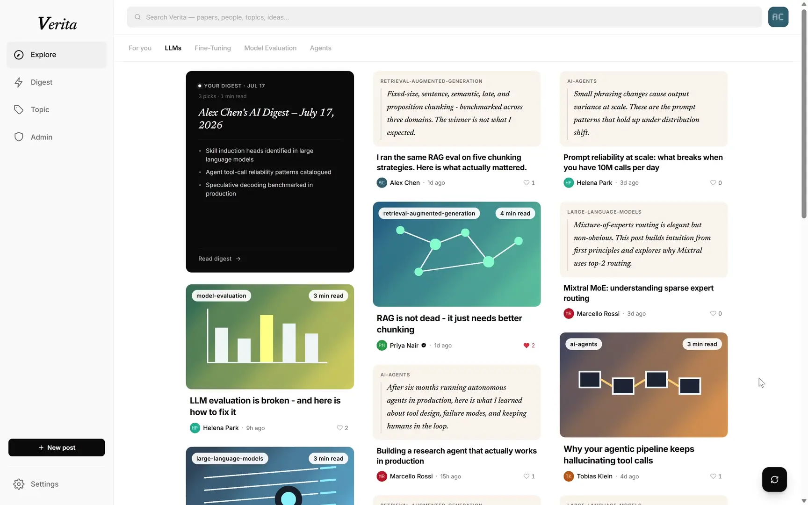
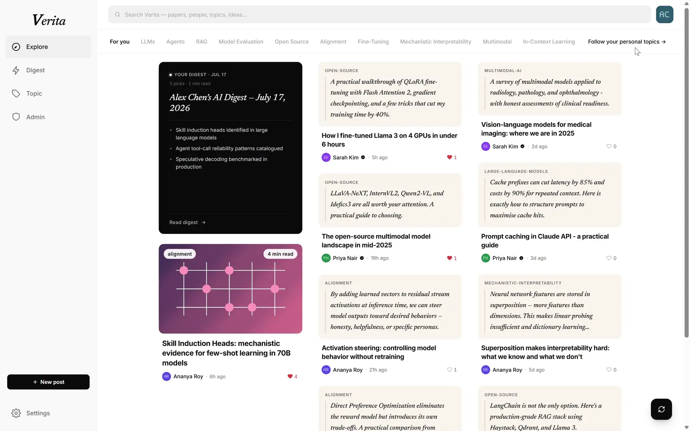
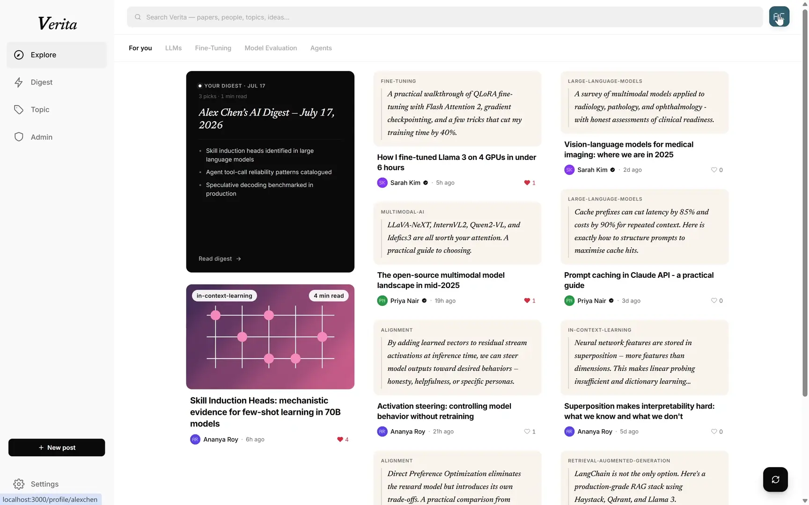

# Review Guide

A guided tour for graders and reviewers: how to get a populated instance running, which
account to use, what to click through, and how to see the operational side (health checks,
API docs, monitoring).

## 1. Get a running, populated instance

**Option A — local (recommended).** Follow the
[Quick Start](../../README.md#quick-start-with-docker-compose-local) in the root README:

```bash
# add an LLM API key to enable AI features
cp genai-service/.env.example genai-service/.env
docker compose up --build

# once the services are healthy
npm install && npm run seed:local
```

**Option B — live environments.** Use the deployed instances listed under
[Cloud Deployments](../../README.md#cloud-deployments) — production and dev on the TUM Rancher
cluster, plus a single Azure VM running the same containers via Docker Compose. On the dev
environment, type `thisisunsafe` if the browser blocks the self-signed TLS certificate.

## 2. Log in and explore

Open `http://localhost:3000` (or a live environment) and sign in as **`alexchen`**
(email `alex@example.com`, password `Password123!`). This admin account is seeded with
content across every area, so you can walk through all features in the
[feature check list](Check_List.md).

Highlights worth visiting:

- **Home feed** — masonry grid of seeded posts; filter by topic chips, like and bookmark.
- **Post detail** — comments (top/newest/oldest), replies, AI-generated summary when the
  GenAI service has an API key.
- **Digest** — the daily AI digest page; per-user digests plus a public fallback.
- **Topics** — follow/unfollow a topic and see it appear in the home-feed filter bar.
- **Profile & settings** — edit profile, upload an avatar, toggle bookmark/like visibility.
- **Admin panel** (`/admin`, admin account only) — user management and GenAI operations:
  switch the LLM provider/model at runtime, re-run failed post summaries, and generate a
  digest for a chosen user and day. The GenAI features are documented step-by-step in
  [GenAI Environment Setup](../contributing/GenAI_Environment_Setup.md).

Three of them recorded against a seeded stack, sped up. The core loop, digest, authoring, and
admin clips are in the [README](../../README.md#see-it-running).

**Search**



Recent and trending queries on focus; results come back ranked across posts, people, and topics.

**Topics**



Follow a topic and it moves to the front of its group, then shows up as a filter on the feed.

**Profile**



Posts, bookmarks, likes, and drafts per user. Unpublish a post back into Drafts, or edit the bio,
links, and research interests.

## 3. Health checks

All services run Docker health checks every 30 seconds and expose a status endpoint:

```text
http://localhost:8081/actuator/health   # user-service
http://localhost:8082/actuator/health   # content-service
http://localhost:8083/actuator/health   # recommendation-service
http://localhost:8000/health            # genai-service
```

On the deployed environments the backends are not directly reachable — the frontend nginx
gateway is the only public entry point and returns 404 for actuator paths (see
[API Gateway & Routing](../infrastructure/API_Gateway_Routing.md)).

## 4. API documentation and API client

- **Rendered API docs** for all four services are published to GitHub Pages:
  <https://AET-DevOps26.github.io/team-colleague-md/> (built from each service's
  `openapi.yaml` on merge to `main`).
- **Interactive genai docs**: `http://localhost:8000/docs` (FastAPI Swagger UI).
- **Bruno collection**: [`bruno/`](../../bruno/README.md) contains ready-made requests for all
  services and environments if you want to exercise the APIs directly.

## 5. View monitoring

**Locally** (adds Prometheus + Grafana on top of the dev stack):

```bash
docker compose -f docker-compose.yml -f docker-compose.monitoring.yml -f docker-compose.monitoring.local.yml up -d
# Grafana    http://localhost:3001  (admin / verita_grafana_admin)
# Prometheus http://localhost:9090
```

Open the pre-provisioned **Verita — Services Overview** dashboard in Grafana: request
rate, 5xx error ratio, latency percentiles, JVM and database-pool metrics per service. The Prometheus
`node` target reads DOWN locally by design (the host exporter cannot run on Docker
Desktop).

**On Rancher**, both environments run their own monitoring stack, served through the shared
ingress at `/grafana` with the same `admin / verita_grafana_admin` login as local:

| Environment | Grafana |
|---|---|
| Production | https://verita.stud.k8s.aet.cit.tum.de/grafana |
| Development | https://dev.verita.stud.k8s.aet.cit.tum.de/grafana |

**On the Azure VM**, the monitoring stack binds to localhost only and is reached over an
SSH tunnel.

Details on what is collected and how discovery works per environment:
[`infra/monitoring/README.md`](../../infra/monitoring/README.md).
